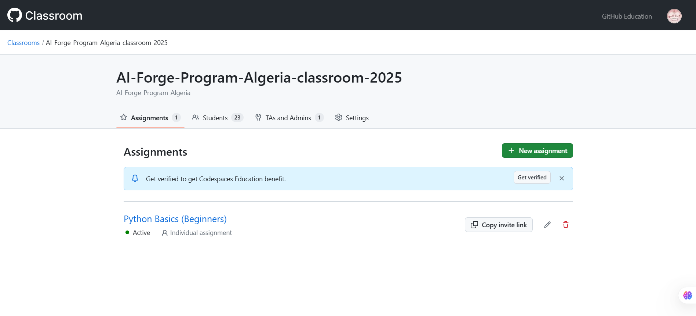

# AI-Forge-Course-2025

Welcome to the **AI Forge Program**! This program is designed to guide you through the foundations of Artificial Intelligence, Machine Learning, and Deep Learning over the course of seven weeks. Each week contains a dedicated folder with course materials, as well as a corresponding Jupyter Notebook to solidify your understanding with hands-on exercises.

---

## Weekly Outline

| Week | Unit Name                              | Link to Course (GitHub Folder)                                    | Link to Notebook                                                     |
|:----:|:---------------------------------------|:------------------------------------------------------------------:|:---------------------------------------------------------------------:|
|  1   | **Array Algebra and NumPy**            | [Week 1 Folder](1_courses/2_advanced_track/1_array_algebra/) | [Array Algebra](1_courses/2_advanced_track/1_array_algebra/array_algebra.ipynb) |
|  2   | **Probabilistic Thinking and ML**      | [Week 2 Folder](https://github.com/your-repo/AI-Forge/tree/main/Week2) | [Week 2 Notebook](https://github.com/your-repo/AI-Forge/blob/main/Week2/Week2_Notebook.ipynb) |
|  3   | **Deep and Semi-supervised Learning**  | [Week 3 Folder](https://github.com/your-repo/AI-Forge/tree/main/Week3) | [Week 3 Notebook](https://github.com/your-repo/AI-Forge/blob/main/Week3/Week3_Notebook.ipynb) |
|  4   | **Computer Vision**                    | [Week 4 Folder](https://github.com/your-repo/AI-Forge/tree/main/Week4) | [Week 4 Notebook](https://github.com/your-repo/AI-Forge/blob/main/Week4/Week4_Notebook.ipynb) |
|  5   | **Generative AI**                      | [Week 5 Folder](https://github.com/your-repo/AI-Forge/tree/main/Week5) | [Week 5 Notebook](https://github.com/your-repo/AI-Forge/blob/main/Week5/Week5_Notebook.ipynb) |
|  6   | **Other AI Topics**                    | [Week 6 Folder](https://github.com/your-repo/AI-Forge/tree/main/Week6) | [Week 6 Notebook](https://github.com/your-repo/AI-Forge/blob/main/Week6/Week6_Notebook.ipynb) |
|  7   | **Special Guests Sessions**            | [Week 7 Folder](https://github.com/your-repo/AI-Forge/tree/main/Week7) | [Week 7 Notebook](https://github.com/your-repo/AI-Forge/blob/main/Week7/Week7_Notebook.ipynb) |

---

## How to Use This Repository

1. **Clone or Download** this repository to your local machine.
2. Navigate to the folder for the week you want to work on.
3. Open the corresponding Jupyter Notebook to follow along with the lesson and complete the exercises.
4. Feel free to explore the other files and resources in each week’s folder.

---

## Assignments

1. All assignments will be done in [Github Classrooms](https://classroom.github.com/classrooms)

---

## Contributing

Contributions are welcome! If you have any improvements to suggest or would like to add additional materials, please open an [issue](https://github.com/your-repo/AI-Forge/issues) or submit a pull request.

---

## License

This project is licensed under the [MIT License](LICENSE.md).

